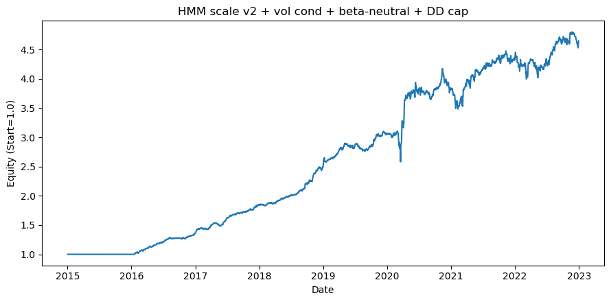
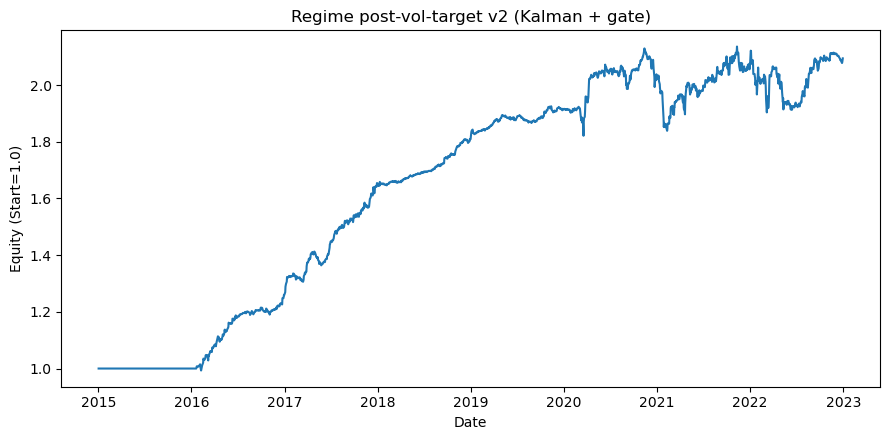
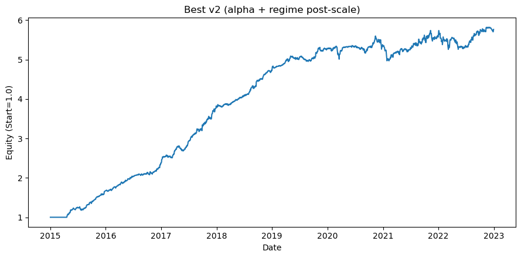

# US Equity Alpha Research

<p align="center">
  A U.S. equity research repo built around cross-sectional alpha design, causal regime filtering, and practical portfolio construction.
</p>

<p align="center">
  <a href="notebooks/alpha_mom.ipynb">Momentum Notebook</a> |
  <a href="notebooks/hmm_alpha_v2.ipynb">Regime Notebook v2</a> |
  <a href="notebooks/ma_crossover.ipynb">MA Crossover</a> |
  <a href="notebooks/function_sets.ipynb">Research Utilities</a>
</p>

## Research Thesis

This repository studies whether a simple cross-sectional trend signal can be made materially more robust through regime-aware exposure control and practical portfolio construction. The research is organized around three questions:

- can a simple cross-sectional trend signal survive realistic portfolio construction?
- does causal regime filtering improve exposure timing?
- do layered portfolio controls improve the quality of the equity curve, not only the headline return?

## Methodological Note

The public results in this README are drawn only from the `v2` regime workflow in [`notebooks/hmm_alpha_v2.ipynb`](notebooks/hmm_alpha_v2.ipynb). That path uses causal HMM re-estimation and causal Kalman filtering. The earlier [`notebooks/hmm_alpha.ipynb`](notebooks/hmm_alpha.ipynb) notebook is retained as archived research history and is not used for reported results because its regime fit relied on full-sample HMM estimation.

## Snapshot

| Item | Detail |
| --- | --- |
| Universe | top `~3000` U.S. common stocks |
| Coverage | `2015-01-01` to `2022-12-31` |
| Frequency | daily |
| Portfolio style | long-short, beta-aware, volatility-scaled |
| Core modules | EMA trend, HMM regime filter, Kalman filter overlay, drawdown cap |

## Representative Results

Two reference points summarize the current `v2` research path:

| Configuration | Sharpe | CAGR | Total Return | Max Drawdown | Avg Turnover |
| --- | ---: | ---: | ---: | ---: | ---: |
| Representative v2 stack: regime scale + vol condition + beta neutralization + drawdown cap | `1.81` | `20.7%` | `3.65x` | `-16.9%` | `0.277` |
| Best saved v2 configuration from grid search | `2.73` | `23.9%` | `4.76x` | `-11.2%` | `0.167` |

The best saved `v2` configuration combines a fast EMA trend signal (`4/9` spans), tighter tail selection (`top_frac=0.05`), dynamic regime mapping, causal Kalman filtering, and post-weight volatility targeting. The improvement is not attributable to a single overlay in isolation. It emerges from the interaction between a cleaner base alpha, more selective portfolio formation, smoother regime scaling, and explicit risk control.

## Equity Curves

The figures below are exported from the executed `v2` notebook and reflect the current public research path.

| Representative v2 Stack | Kalman Post-Scale Overlay | Best Saved v2 Configuration |
| --- | --- | --- |
|  |  |  |

## Why The Methods Help

- **Cross-sectional EMA trend** provides a simple base signal that reacts quickly to intermediate-horizon trend persistence. The objective is relative ranking across stocks, not point forecasting of returns.
- **Tail selection and robust scaling** concentrate capital in the strongest names and reduce the impact of small, noisy scores. This improves signal-to-noise and keeps weak convictions from dominating turnover.
- **HMM regime probabilities** convert aggregate market conditions into an exposure-scaling signal. In this framework the HMM is a sizing layer, not a standalone directional model.
- **Kalman filtering** smooths noisy regime probabilities without introducing forward-looking information. Its primary contribution is to reduce whipsaw, abrupt leverage changes, and unstable sizing decisions.
- **Volatility targeting, beta control, and drawdown caps** act at the portfolio level. These overlays are designed to keep exposure aligned with current signal quality and to prevent adverse environments from overwhelming the alpha.

The main empirical conclusion from the current runs is that Kalman filtering improves the stack primarily as a stabilizer rather than as a standalone source of alpha. The strongest results appear when regime smoothing is combined with a stronger alpha specification, dynamic regime scaling, and post-weight risk management.

## Research Workflow

1. Build daily panels from Yahoo Finance and reference files.
2. Generate a cross-sectional alpha from price or fundamentals.
3. Convert signals into neutralized portfolio weights.
4. Apply regime scaling, volatility targeting, beta control, and drawdown control.
5. Score the result with return, Sharpe, turnover, and concentration penalties.
6. Review diagnostics and equity-curve behavior before treating a configuration as a credible research result.

## Repository Structure

- `src/us_equity/alphas/`: alpha and regime modules
- `src/us_equity/overlays/`: portfolio overlays and scaling logic
- `src/us_equity/search/`: grid-search and quality scoring utilities
- `notebooks/`: main research notebooks
- `data/reference/`: ticker and metadata inputs
- `outputs/regime_v2/`: saved results from the clean v2 regime search

## Run

```bash
python -m compileall src scripts
python scripts/yf_price_pipeline.py --tickers data/reference/tickers.csv --outdir data/market/yf_data
python scripts/yf_ohlcv_and_meta.py --tickers data/reference/tickers.csv --outdir data/market/yf_data --progress
python -m jupyter lab
```
