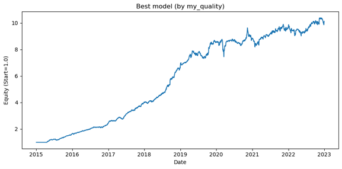
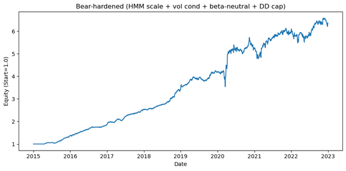
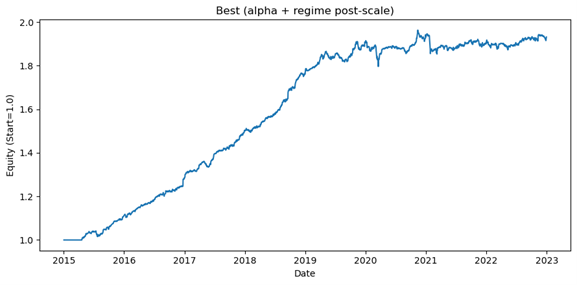

# US Equity Alpha Research

  A long-short U.S. equity research sandbox focused on robust cross-sectional signals, regime-aware overlays, and cleaner risk-adjusted implementation.

  <a href="alpha_mom.ipynb">Momentum Notebook</a> |
  <a href="hmm_alpha.ipynb">HMM Overlay</a> |
  <a href="ma_crossover.ipynb">MA Crossover</a> |
  <a href="function_sets.ipynb">Function Set</a>

## Research Thesis

The objective is not to maximize raw backtest return. The objective is to build equity signals that remain usable after neutralization, turnover control, and regime scaling. This repo therefore emphasizes:

- robust signal construction on noisy daily cross-sections
- exposure control through HMM and Kalman overlays
- practical portfolio formation rather than pure indicator ranking
- notebook diagnostics that make failure modes visible quickly

## Snapshot

| Item | Detail |
| --- | --- |
| Universe | top `~3000` U.S. common stocks |
| Coverage | `2015-01-01` to `2022-12-31` |
| Frequency | daily |
| Portfolio style | long-short, neutralized, risk-scaled |
| Core themes | EMA trend, HMM regime scaling, Kalman smoothing |

## Performance Snapshot

| Alpha | Annual Sharpe | CAGR | Total Return | Turnover | Max Drawdown |
| --- | ---: | ---: | ---: | ---: | ---: |
| EMA Crossover | `2.65` | `0.327` | `9.128` | `0.447` | `-0.159` |
| HMM Overlay | `2.11` | `0.254` | `5.3707` | `0.3095` | `-0.1686` |
| Kalman Overlay | `2.12` | `0.0838` | `0.93` | `0.110` | `-0.062` |

## Visual Diagnostics

| EMA | HMM | Kalman |
| --- | --- | --- |
|  |  |  |

## Research Stack

| Layer | Files |
| --- | --- |
| Signal modules | `alpha_*.py`, `risk_overlays.py`, `kalman_overlays.py`, `simfin_loading.py`, `sector_loader.py` |
| Search utilities | `grid_search_pipeline.py`, `grid_search_with_regime.py` |
| Main notebooks | [`alpha_mom.ipynb`](alpha_mom.ipynb), [`alpha_mom_v2.ipynb`](alpha_mom_v2.ipynb), [`hmm_alpha.ipynb`](hmm_alpha.ipynb), [`ma_crossover.ipynb`](ma_crossover.ipynb), [`function_sets.ipynb`](function_sets.ipynb) |
| Versioned lightweight inputs | `tickers.csv`, `company_tickers.json` |
| Local-only artifacts | `yf_data/`, `close.parquet`, `yf_data.zip`, `grid_results*.csv` |

## Pipeline

1. Build an alpha matrix from daily price, volume, or fundamentals.
2. Convert signals into neutralized portfolio weights.
3. Apply optional vol targeting or regime overlays.
4. Backtest with transaction costs and score results with the kinked quality function.

## Repo Notes

- The project stays flat because the notebooks and modules rely on direct relative imports and local paths.
- `ma_crossover.ipynb` was preserved from the existing repo because it differs from the old workspace copy and appears newer.
- `function_sets-Copy1.ipynb` is treated as scratch and kept out of Git by `.gitignore`.
- The README structure is inspired by the best parts of public quant and ML-for-trading repos: a strong top snapshot, a quick performance table, a visual section, and a clear file map.
